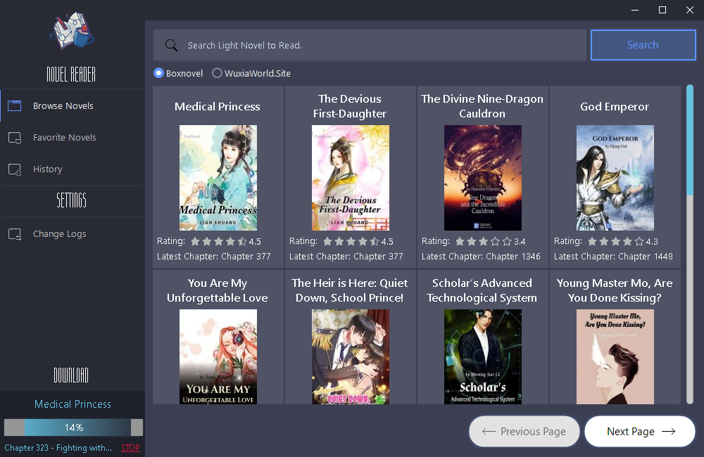
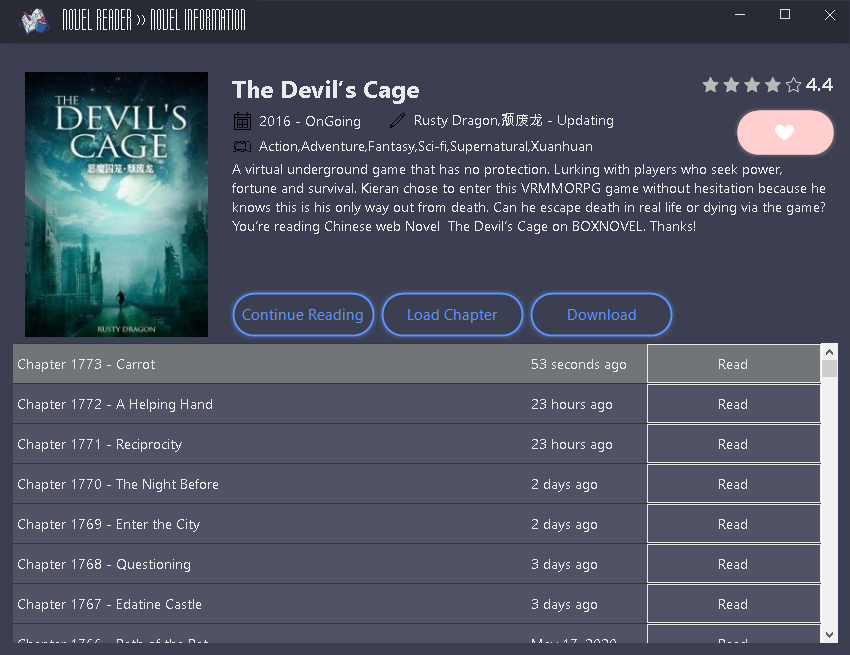
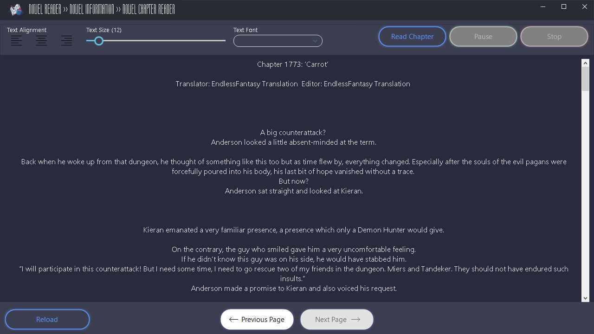

  

<h1 align="center">Light/Web Novel Reader Desktop Application</h1>

## Novel Reader

A Light Novel or Web Novel Reader for Windows/Desktop, this app use webscrapping for getting data to website showing it to the app. Download the latest version.

Website Source

- [BoxNovel](https://boxnovel.com/)
- [Wuxiaworldsite](https://Wuxiaworld.site/)
- [RoyalRoad](https://www.royalroad.com/)
- [NovelCrush](https://novelcrush.com/)
- [NoveFull](https://novelfull.com/)

## Interface

  

  

  

## Features

- Search
- Displaying novel information
- Changing font size and font
- Text alignment
- Text-to-speech
- Download to PDF
- Add to favorites
- History/Recent novels

## Built With

- [GUNA Framework](https://gunaframework.com/) - The .Net Framework used
- [HtmlAgilityPack](https://html-agility-pack.net/) - Data Webscrapping
